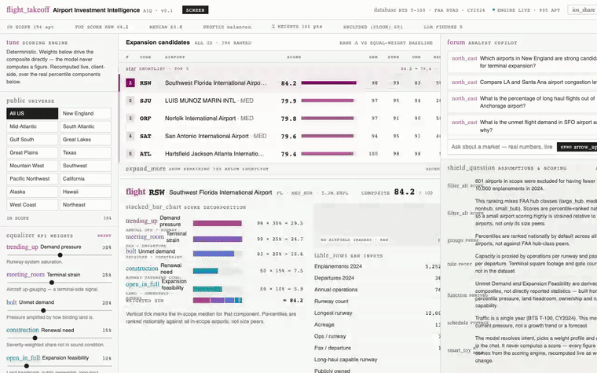

# ✈️ Airport Investment Intelligence Agent

An AI assistant that helps analysts identify US airports where modernization or
expansion is most likely to pay off — backed by a **deterministic scoring
engine** over public BTS and FAA data.

The language model never computes a number. It resolves names, picks a
weighting, calls tools, and explains the results. Every figure comes from
`scoring/`, which has no dependency on `google-genai` or any other LLM SDK.

📄 **[ARCHITECTURE.md](ARCHITECTURE.md)** — scoring methodology, tradeoffs, and
where AI is used.



*Weight sliders re-rank instantly (client-side, over the real percentile
components), a region filter, and a genuine streamed answer from the chat
agent — no scripted output.*

---

## Quick start

Requires [uv](https://docs.astral.sh/uv/) and Python 3.11+.

```bash
uv sync --extra dev
export GEMINI_API_KEY=AIza...            # chat only; scoring works without it
                                          # free, no card: aistudio.google.com/apikey

uv run python -m airport_iq.ingest       # build the dataset (~30s first run)
uv run uvicorn airport_iq.api.main:app --port 8000
```

Open **http://localhost:8000** for the web terminal UI (shown above — ranked
table, live weight sliders, chat), or run `uv run streamlit run ui/app.py` in
a second terminal for the simpler Streamlit chat + sidebar view at
http://localhost:8501. Both talk to the same FastAPI backend.

---

## The scoring engine, without the model

The deterministic endpoints need no API key:

```bash
curl 'localhost:8000/rank?region=new_england&weight_profile=terminal&top_n=5'
curl 'localhost:8000/airport/SFO'
curl 'localhost:8000/compare?codes=LAX,SNA'
curl 'localhost:8000/options'
```

`/rank` returns exactly the numbers the chat quotes — same engine, one path
with a model in front and one without.

---

## What it scores

995 US airports, from four key-free public sources:

- **BTS T-100** — passengers, departures, arrivals (CY2024)
- **FAA Runways (NTAD)** — count, length, surface, pavement condition
- **FAA Aviation Facilities (NTAD)** — acreage, ownership, location
- **OurAirports** — names, identifiers, coordinates

Five weighted components:

| Component | Measures |
|---|---|
| Demand Pressure | operations per runway |
| Terminal Strain | passengers per departure (aircraft up-gauging) |
| Unmet Demand | pressure × how binding the physical constraint is |
| Renewal Need | severity-weighted share of runway length needing work |
| Expansion Feasibility | land headroom, public ownership, long-haul capability |

Four weight profiles — `balanced`, `terminal`, `runway`, `renewal` — selected
by the agent from the question and always stated in the answer.

---

## Example questions

```
Which airports in New England are strong candidates for terminal expansion?
Compare LA and Santa Ana airport congestion levels.
What is the percentage of long haul flights out of Anchorage airport?
What is the unmet flight demand in SFO airport and why?
```

The Anchorage question is the interesting one: no key-free source publishes
per-route distance, so the agent reports that the figure **cannot be computed**
and gives a runway-capability proxy instead of inventing a percentage. Setting
`OPENSKY_CLIENT_ID` / `OPENSKY_CLIENT_SECRET` enables the real computation.

---

## Tests

```bash
uv run pytest -q                                # 65 tests, no API key needed
uv run pytest tests/test_brief_questions.py -v  # agent tests (needs a key)
```

Covers golden published figures, determinism, monotonicity, missing-data
renormalization, and the regression where `EXCELLENT` pavement was scored as
maximum renewal need.

---

## Layout

```
config/          weight profiles, region definitions
src/airport_iq/
  providers/     BTS + FAA + OurAirports clients, HTTP cache, route providers
  ingest.py      joins sources -> data/airports.parquet
  scoring/       kpis · normalize · model · explain   (no LLM)
  service.py     query façade shared by the API and the agent
  agent/         tools · system prompt · session loop
  api/main.py    FastAPI
ui/app.py        Streamlit chat + breakdown panel
ui/web/          Web terminal UI (static, served by FastAPI itself)
tests/
```

---

## Offline

Every fetch is cached to `data/cache/`, and the built table lives in
`data/airports.parquet`. Once ingested, the whole system runs with the network
unplugged; providers fall back to a stale cache rather than failing, and report
`source: cache` so staleness is visible rather than silent.
